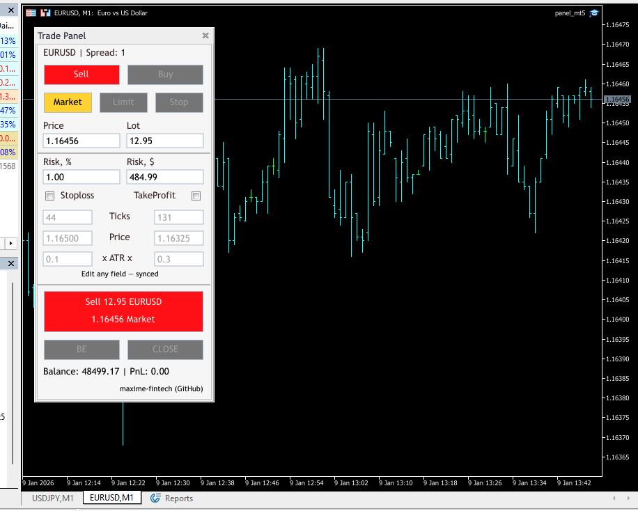
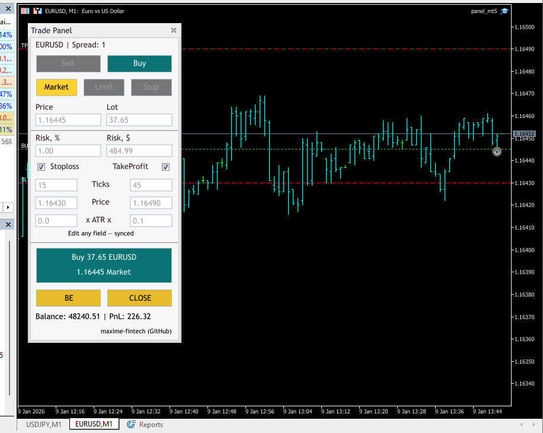

# MT5 Trade Panel — Portfolio Showcase

This is a production‑quality **MetaTrader 5 trade panel** built as a portfolio piece. The focus is on UI craftsmanship, clean architecture, and safe state handling in MQL5. It is a **manual trading assistant**, not a strategy or signal system.

## What this shows

- MVC‑style separation (View / Controller / Logic)
- Fully synchronized risk, price, and SL/TP inputs
- Broker‑aware lot sizing with normalization
- Persistent panel state across restarts and timeframe changes
- Safe UI locking during active orders/positions

## Features

- Market / Limit / Stop modes
- Buy / Sell switching
- SL / TP input via ticks, price, or ATR multiplier
- Risk input in % or $ with automatic lot calculation
- BE (breakeven) and CLOSE actions
- Chart lines for Entry, SL, TP

## Screenshots




Place screenshots in `screenshots/`:

screenshots/
├── panel_overview.png
├── panel_active_trade.png
├── panel_logic_limit.png
└── panel_logic_stop.png

## How to run

1. Copy the project into your MetaTrader 5 `MQL5/Experts` directory.
2. Open MetaEditor and compile `src/panel_mt5.mq5`.
3. Attach the expert to any chart.
4. Configure risk and SL/TP directly from the panel UI.

## Behavior notes

- All editable fields lock while an order/position is active.
- SL/TP fields disable when their checkbox is off.
- Limit/Stop require valid price conditions before Trade is enabled.
- Lot sizing respects `SYMBOL_VOLUME_MIN`, `SYMBOL_VOLUME_MAX`, `SYMBOL_VOLUME_STEP`.

## Project structure

```
src/
├── panel_mt5.mq5
└── modules/
    ├── Panel_MT5_Controller.mqh
    ├── Panel_MT5_Order.mqh
    ├── Panel_MT5_Calcul.mqh
    ├── Panel_MT5_Types.mqh
    ├── Panel_mt5_View.mqh
    ├── Panel_mt5_View_UI.mqh
    └── Panel_mt5_View_Logic.mqh
```

## Docs

- Architecture overview: `docs/architecture.md`
- State model: `docs/state-model.md`

## Notes

- Provided for demonstration purposes only.
- Not financial advice.

## Author

**Maxime**  
GitHub: https://github.com/maxime-fintech
